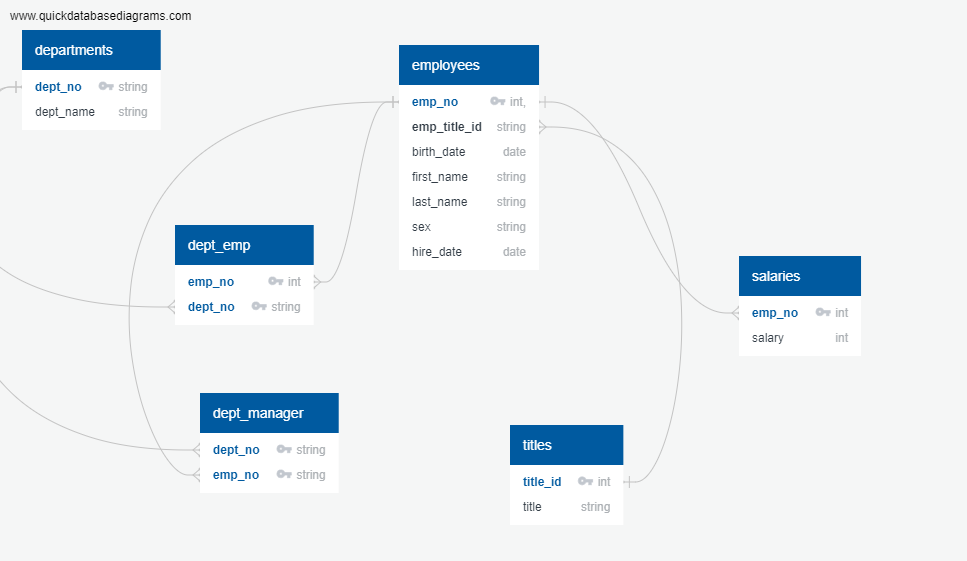
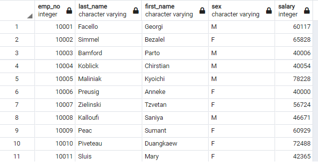
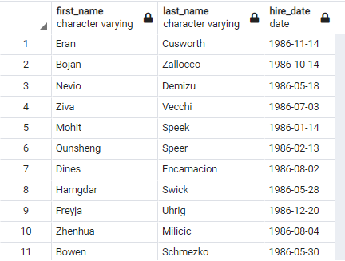
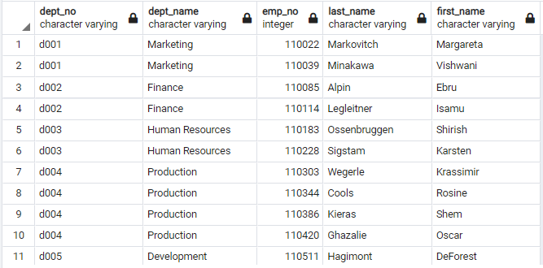
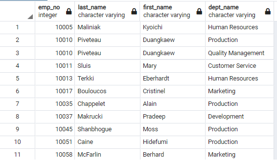
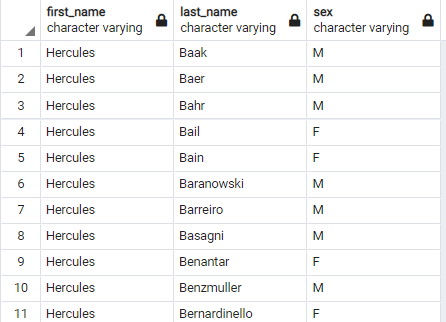
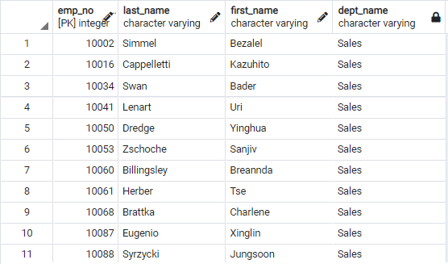
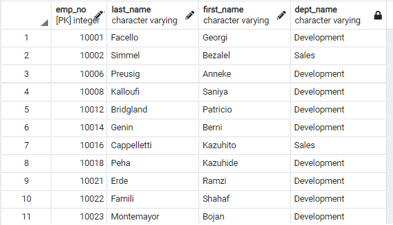
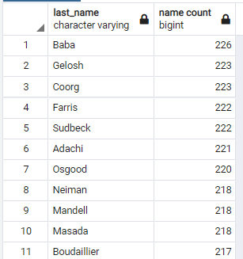

# sql-challenge
# Introduction
The purpose of this challenge is to use PostgreSQL as the main database for Employee data analysis and Pandas for visualisation.

It is essential to follow all the steps prescribed below under **Procedures**

## Database design (Entity Relationship Diagram)
In this analysis, there are 6 sets of data available as comma-delimited (csv) files;
1. departments  
2. dept_emp  
3. dept_manager  
4. employees  
5. salaries  
6. titles  

The following relationships are observed;
1. An employee only has one title and one salary
2. An employee belongs to multiple department
3. A department can have mulitple manager
 
  

**NB.** The data files are located in subfolder `Resources` within folder `EmployeeSQL`. 


## Procedures
There are **3** coding files to this analysis, a `schema.sql`, `emp_analysis.sql` to be used in pgAdmin4 and `bonus analysis.ipynb` in Jupyter notebook.
1. Create a new folder `CSV_files` in your local directory `C:\Users\Public`
2. Download all csv files in `EmployeeSQL\Resources` to `C:\Users\Public\CSV_Files` **NB** File Path _must_ be as shown
3. Download all 3 coding files from folder `EmployeeSQL`
4. Start and run pgAdmin4 
5. Setup a new database
6. Read in and run `schema.sql` query file
7. Once schema.sql is completed successfully, read in and run `emp_analysis.sql`

### Bonus Analysis
8. In the directory where `bonus analysis_ipynb` is located, create a `config.py` with the following content  
```
postgresql = {'pguser':'{username}',
            'pgpasswd':'{password}',
            'pghost':'{host}',
            'pgport': 5432,
            'pgdb': '{database_name}'
            }
```
    replace `{username}`, `{password}`and `{host}` with Postgresql login details, `{database_name}` with name setup in **step 5**  

9. Open and run code file `bonus analysis_ipynb` in jupyter notebook.  

## Analysis Output
1. List the following details of each employee: employee number, last name, first name, sex, and salary.  
  

2. List first name, last name, and hire date for employees who were hired in 1986.  
  

3. List the manager of each department with the following information: department number, department name, the manager's employee number, last name, first name.  
  

4. List the department of each employee with the following information: employee number, last name, first name, and department name.  
  

5. List first name, last name, and sex for employees whose first name is "Hercules" and last names begin with "B."  
  

6. List all employees in the Sales department, including their employee number, last name, first name, and department name.  
  

7. List all employees in the Sales and Development departments, including their employee number, last name, first name, and department name.  
  

8. List the frequency count of employee last names (i.e., how many employees share each last name) in descending order.  
  

### Bonus Analysis
9. Create a histogram to visualize the most common salary ranges for employees.
  

10. Create a bar chart of average salary by title.
  

    a. Boxplot to highlight any outliers in data


# Conclusion
Investigation into the dataset found issues with the integrity of the data. There are currently 300,024 employees employed spreadout between 9 departments and 7 employment titles. However, review into employees salary indicate there are close to 2,847 employees (0.95%) that are paid outside of the normal salary range for their title/role, as shown in the boxplot chart above. Further analysis into last name further shows there are only 1,638 unique last names which suggest on average 183 employees shares each last name. In a dataset this size, it would be acceptable to expect at least 10% of unique last names and lower percentage of outliers. Therefore the data should be further reviewed to ensure the accuracy of the anlalysis.
