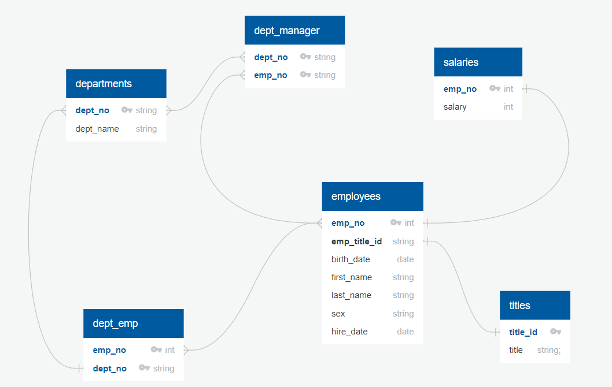

# sql-challenge
# Introduction
The purpose of this challenge is to use PostgreSQL as the main database for Employee data analysis and Pandas for visualisation.

It is essential to follow all the steps prescribed below under **Procedures**

## Database design (Entity Relationship Diagram)
In this analysis, there are 6 sets of data available as comma-delimited (csv) files;
1. departments  
2. dept_emp  
3. dept_manager  
4. employees  
5. salaries  
6. titles  

The following relationships are observed;
1. An employee only has one title and one salary
2. An employee belongs to multiple department
3. A department can have mulitple manager
 
  

**NB.** The data files are located in subfolder `Resources` within folder `EmployeeSQL`. 


## Procedures
There are **3** coding files to this analysis, a `schema.sql`, `emp_analysis.sql` to be used in pgAdmin4 and `bonus analysis.ipynb` in Jupyter notebook.
1. Create a new folder `CSV_files` in your local directory `C:\Users\Public`
2. Download all csv files in `EmployeeSQL\Resources` to `C:\Users\Public\CSV_Files` **NB** File Path _must_ be as shown
3. Download all 3 coding files from folder `EmployeeSQL`
4. Start and run pgAdmin4 
5. Read in and run `schema.sql` query file
6. Once schema.sql is completed successfully, read in and run `emp_analysis.sql`

### Bonus Analysis
1. In the directory where `bonus analysis_ipynb` is located, create a `config.py` with the following content  
```
postgresql = {'pguser':'{username}',
              'pgpasswd':'{password}',
              'pghost':'{host}',
              'pgport': 5432,
              'pgdb': '{database_name}'
             }
```
replace `{username}`, `{password}`, `{host}` and `{database_name}` with Postgresql login details.
